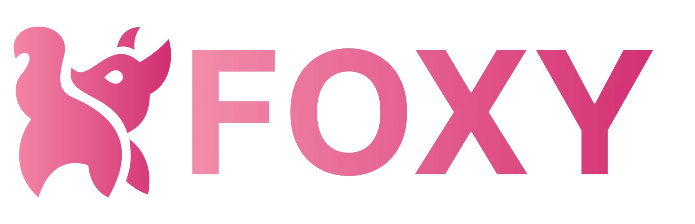
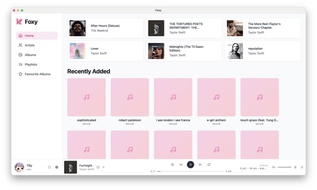
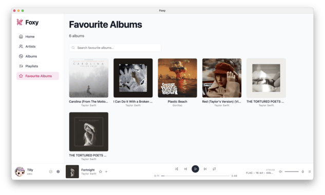

# Foxy Desktop
## Jellyfin desktop music player




Foxy Desktop is a modern music player for your Jellyfin library, designed to provide a smoother, more enjoyable listening experience than the default web interface.

## Features
- Fast and responsive UI
- Full support for Jellyfin music libraries
- Integrates with now playing on your desktop
- Support for timesynced lyrics

## Screenshots





## Installation
Download the latest release for your platform from the [releases page](https://github.com/Devioxic/Foxy-Desktop/releases).

## Roadmap
- [ ] Add support for more themes
- [ ] Add a full library search
- [ ] Add support for crossfade and more playback settings
- [ ] Offline playback support

## Bugs? Suggestions?
If you find any bugs or have suggestions for new features, please open an [issue](https://github.com/Devioxic/Foxy-Desktop/issues).

## Contributing
If you want to contribute to the project, feel free to open a pull request.

## Development
### Prerequisites
- Node.js (v23 or later)
- npm (v11 or later)

### Setup
1. Clone the repository:
```bash
git clone https://github.com/Devioxic/Foxy-Desktop.git
cd Foxy-Desktop
```
2. Install dependencies:
```bash
npm install
```
3. Start the development server:
```bash
npm start
```

### Building
To build the application for production, run:
```bash
npm run make
```

## License
This project is licensed under the GNU Affero General Public License v3.0. See the [LICENSE](LICENSE.md) file for details.